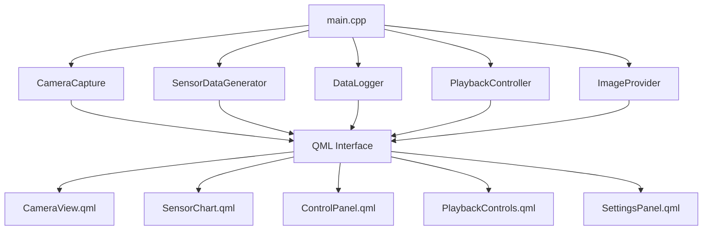

# Camera Sensor Dashboard - Enhanced

 **Professional Qt6/QML Application** with C++ backend for real-time sensor monitoring, camera capture, and data analysis. Features enhanced visualization, advanced playback controls, and comprehensive data storage.

##  Features

###  **Camera System**
- **Live Camera Feed**: Real-time webcam capture using OpenCV 4.x
- **Auto Frame Saving**: Automatic image capture every 5 seconds during recording
- **Multiple Resolutions**: 640x480, 1280x720, 1920x1080 support
- **Professional Image Storage**: JPEG format with timestamp naming

###  **Sensor Data System** 
- **Dual Sensor Simulation**: Temperature (15-35°C) and Pressure (990-1030 hPa)
- **Configurable Sample Rates**: 0.5Hz, 1.0Hz, 5.0Hz with real-time switching
- **Live Visualization**: Real-time scrolling charts with smooth animations
- **Statistical Display**: Current values with color-coded indicators

###  **Data Management**
- **Automatic CSV Logging**: Complete sensor data with ISO timestamps
- **Synchronized Storage**: Camera frames and sensor data perfectly aligned
- **Professional File Naming**: `sensor_log_YYYYMMDD_HHMMSS.csv` format
- **Organized Structure**: All data stored in `build/data/` directory

###  **Enhanced Playback System**
- **Advanced Controls**: Play, Pause, Stop, Rewind, Forward
- **Variable Speed**: 0.1x to 10x playback with smooth transitions
- **Frame-by-Frame**: Precise data point navigation
- **Progress Seeking**: Click-to-jump timeline navigation
- **Loop Mode**: Automatic replay functionality
- **Bookmark System**: Mark important data points
- **Exit Functionality**: Clean return to live data mode

###  **User Interface**
- **Responsive Design**: Clean, professional Qt Quick interface
- **Real-time Status**: Visual indicators for all system components
- **Settings Panel**: Instant configuration changes
- **Error Handling**: User-friendly error dialogs
- **Data Access**: Quick "Open Data Folder" functionality

## Technical Requirements

### Platform
- **Operating System**: Linux (Ubuntu/Debian preferred)
- **Architecture**: x64

### Dependencies
- **Qt 6.5+** with the following modules:
  - Qt6Core
  - Qt6Quick
  - Qt6QuickControls2
  - Qt6Charts
  - Qt6Multimedia
- **OpenCV 4.5+**
- **CMake 3.22+**
- **C++17 compatible compiler** (GCC 9+ or Clang 10+)

## Installation

### Ubuntu/Debian Installation

1. **Install Qt6 dependencies:**
```bash
sudo apt update
sudo apt install qt6-base-dev qt6-declarative-dev qt6-multimedia-dev qt6-charts-dev qml6-module-qtquick-controls qml6-module-qtquick-layouts qml6-module-qtcharts
```

2. **Install OpenCV:**
```bash
sudo apt install libopencv-dev libopencv-contrib-dev
```

3. **Install build tools:**
```bash
sudo apt install cmake build-essential
```

4. **Install additional QML modules:**
```bash
sudo apt install qml6-module-qtquick-dialogs qml6-module-qtquick-window
```

### Alternative: Install Qt6 from Official Installer

If the package manager versions are outdated, download Qt6 from [qt.io](https://www.qt.io/download):

```bash

chmod +x qt-unified-linux-x64-*.run
./qt-unified-linux-x64-*.run
```

Select the following components:
- Qt 6.5.x (or later)
- Qt Quick Controls
- Qt Charts
- Qt Multimedia

## Building the Application

1. **Clone or extract the project:**
```bash
cd /home/computer/Documents/camera-sensor-dashboard
```

2. **Create build directory:**
```bash
mkdir build && cd build
```

3. **Configure with CMake:**
```bash
cmake ..
```

If Qt6 is installed in a custom location:
```bash
cmake -DCMAKE_PREFIX_PATH=/path/to/Qt/6.x.x/gcc_64 ..
```

4. **Build the application:**
```bash
make -j$(nproc)
```

## Running the Application

1. **From build directory:**
```bash
./CameraSensorDashboard
```

2. **Make sure your webcam is connected** and not being used by other applications.

3. **Grant camera permissions** if prompted by your system.

## Usage Guide

### Main Interface

The application window is divided into two main areas:

- **Left Panel**: Camera feed, control buttons, playback controls, and settings
- **Right Panel**: Real-time sensor data graphs and current values display

### Basic Operations

#### Starting Data Acquisition
1. Click **"Start Acquisition"** button
2. Camera feed will begin displaying
3. Sensor graphs will start updating with random data
4. Data logging automatically starts

#### Stopping Data Acquisition
1. Click **"Stop Acquisition"** button
2. Camera feed stops
3. Sensor data generation stops
4. Data logging file is saved

### Settings Configuration

#### Camera Settings
- **Resolution**: Choose from 640x480, 1280x720, or 1920x1080
- Changes apply when camera is restarted

#### Sensor Settings
- **Sampling Rate**: Select 0.5 Hz, 1.0 Hz, or 5.0 Hz
- Changes apply immediately during acquisition

### Data Logging and Playback

#### Automatic Logging
- When acquisition starts, a new CSV file is automatically created
- Files are saved in the `data/` directory within the application folder
- File format: `sensor_log_YYYYMMDD_HHMMSS.csv`

#### CSV File Format
```csv
Timestamp,Temperature(C),Pressure(hPa),FrameFile
2024-01-15T10:30:01,23.5,1013.2,
2024-01-15T10:30:02,24.1,1012.8,
```

#### Loading Recorded Data
1. Click **"Load Recorded Data"** button
2. Select a CSV file from the file dialog
3. Playback controls will appear

#### Playback Controls
- **Play/Pause**: Start or pause data replay
- **Stop**: Stop playback and return to beginning
- **Rewind**: Jump back 10 seconds
- **Forward**: Jump forward 10 seconds
- **Speed Control**: Adjust playback speed (0.1x to 10.0x)
- **Progress Slider**: Seek to any point in the data

## File Structure

```
camera-sensor-dashboard/
├── README.md                     # This documentation file
├── demo_features.md              # Demo features documentation
├── run.sh                        # Convenience script to build and run
├── src/                          # C++ source files
│   ├── main.cpp                  # Application entry point and connection setup
│   ├── CameraCapture.cpp         # Camera handling and frame capture
│   ├── SensorDataGenerator.cpp   # Sensor data simulation 
│   ├── DataLogger.cpp            # CSV and data persistence management
│   ├── PlaybackController.cpp    # Recorded data playback functionality
│   └── ImageProvider.cpp         # QML image provider for camera frames
├── include/                      # C++ header files
│   ├── CameraCapture.h           # Camera interface definitions
│   ├── SensorDataGenerator.h     # Sensor simulation interface
│   ├── DataLogger.h              # Data logging interface
│   ├── PlaybackController.h      # Playback functionality interface
│   └── ImageProvider.h           # QML image provider interface
├── qml/                          # QML interface files
│   ├── qml.qrc                   # Resource collection file
│   ├── main.qml                  # Main application window and layout
│   ├── CameraView.qml            # Camera display component
│   ├── SensorChart.qml           # Chart visualization component
│   ├── ControlPanel.qml          # Recording and control buttons
│   ├── PlaybackControls.qml      # Enhanced playback interface
│   ├── SettingsPanel.qml         # Application settings interface
│   └── ErrorDialog.qml           # Error message display
└── build/                        # Generated build files (created at runtime)
    └── data/                     # Generated data files 
        ├── frame_*.jpg           # Camera frame images
        └── sensor_log_*.csv      # Sensor data CSV files
```

##  Detailed File Purpose and Documentation

###  **Build System**

| **File**                       | **Purpose**                                   | **Description** |
|--------------------------------|-----------------------------------------------|----------------|
| `CMakeLists.txt`               | Build configuration                           | Defines build targets, dependencies, compilation options, and links Qt and OpenCV |
| `run.sh`                       | Convenience runner                            | Script to easily build and run the application in one step |

###  **C++ Source Files (src/)**

| **File**                       | **Purpose**                                   | **Key Functions** |
|--------------------------------|-----------------------------------------------|----------------|
| `main.cpp`                     | Application entry point                       | `main()` - Creates application instances, sets up signal connections, loads QML |
| `CameraCapture.cpp`            | Camera image capture                          | `start()`, `stop()`, `captureFrame()`, `saveFrame()` - Controls camera operations |
| `SensorDataGenerator.cpp`      | Simulates sensor data                         | `start()`, `generateData()`, `setSamplingRate()` - Generates random sensor data at specified rates |
| `DataLogger.cpp`               | Data storage and persistence                  | `startLogging()`, `stopLogging()`, `logSensorData()`, `loadLogFile()` - Manages CSV file operations |
| `PlaybackController.cpp`       | Recorded data playback                        | `loadData()`, `play()`, `pause()`, `setSpeed()`, `seekToPosition()` - Controls data playback |
| `ImageProvider.cpp`            | QML image display bridge                      | `updateImage()`, `requestImage()` - Provides camera frames to QML interface |

###  **C++ Header Files (include/)**

| **File**                       | **Purpose**                                   | **Key Classes/Structs** |
|--------------------------------|-----------------------------------------------|----------------|
| `CameraCapture.h`              | Camera interface definitions                  | `CameraCapture` - Manages webcam using OpenCV |
| `SensorDataGenerator.h`        | Sensor simulation interface                   | `SensorDataGenerator` - Produces random sensor readings |
| `DataLogger.h`                 | Data persistence interface                    | `DataLogger`, `SensorReading` - Handles data storage and loading |
| `PlaybackController.h`         | Playback functionality interface              | `PlaybackController` - Controls data playback operations |
| `ImageProvider.h`              | QML image provider interface                  | `ImageProvider` - Connects C++ camera frames to QML |

###  **QML Interface Files (qml/)**

| **File**                       | **Purpose**                                   | **Key Elements** |
|--------------------------------|-----------------------------------------------|----------------|
| `qml.qrc`                      | Resource collection                           | Lists all QML files to be included in the application |
| `main.qml`                     | Main application window                       | `ApplicationWindow`, layout management, state properties, connections |
| `CameraView.qml`               | Camera display component                      | `Image` with camera image provider source |
| `SensorChart.qml`              | Chart visualization                           | `Canvas`-based line chart with scrolling functionality |
| `ControlPanel.qml`             | Application control buttons                    | Start/Stop acquisition buttons, load data button, status display |
| `PlaybackControls.qml`         | Playback interface                            | Play, pause, rewind, forward, speed control, progress slider |
| `SettingsPanel.qml`            | Settings interface                            | Camera resolution, sensor sampling rate controls |
| `ErrorDialog.qml`              | Error display                                 | Modal dialog for error message presentation |

###  **Runtime Generated Files (build/data/)**

| **File Pattern**               | **Purpose**                                   | **Description** |
|--------------------------------|-----------------------------------------------|----------------|
| `frame_YYYYMMDD_HHMMSS.jpg`    | Camera frame images                           | JPEG images captured every 5 seconds during recording |
| `sensor_log_YYYYMMDD_HHMMSS.csv` | Sensor data files                          | CSV files with temperature, pressure readings and timestamps |
| `sample_sensor_data.csv`       | Sample test data                              | Pre-generated sample data for testing playback functionality |

## Sensor Data Specifications

### Temperature Sensor
- **Range**: 15.0°C to 35.0°C
- **Units**: Celsius (°C)
- **Distribution**: Uniform random distribution
- **Update Rate**: Configurable (0.5Hz, 1Hz, 5Hz)

### Pressure Sensor  
- **Range**: 990.0 hPa to 1030.0 hPa
- **Units**: Hectopascals (hPa)
- **Distribution**: Uniform random distribution
- **Update Rate**: Configurable (0.5Hz, 1Hz, 5Hz)

## Troubleshooting

### Camera Issues
- **"Failed to open camera"**: 
  - Check if webcam is connected
  - Ensure no other applications are using the camera
  - Try different camera resolutions

### Build Issues
- **Qt6 not found**:
  - Install Qt6 development packages
  - Set CMAKE_PREFIX_PATH to Qt installation directory
  
- **OpenCV not found**:
  - Install OpenCV development packages
  - Check OpenCV version compatibility

### Runtime Issues
- **Application crashes on startup**:
  - Check Qt6 QML modules are installed
  - Verify all shared libraries are available

- **No camera feed**:
  - Grant camera permissions to the application
  - Check camera device permissions (`ls -l /dev/video*`)

### Data Directory Issues
- **Cannot save log files**:
  - Check write permissions in application directory
  - Ensure sufficient disk space

##  Technical Implementation Details

### Application Architecture



###  **Signal/Slot Connections**

#### Data Flow Connections
```cpp
// Sensor data to logger (main.cpp:41-42)
QObject::connect(&sensorGenerator, &SensorDataGenerator::dataReady,
                 &dataLogger, &DataLogger::logSensorData);

// Camera frame to image provider (main.cpp:33-34)
QObject::connect(&cameraCapture, &CameraCapture::frameReady,
                 imageProvider, &ImageProvider::updateImage);

// Camera frame saving to logger (main.cpp:37-38)
QObject::connect(&cameraCapture, &CameraCapture::frameSaved,
                 &dataLogger, &DataLogger::logFrame);
```

#### Data Synchronization
- **Real-time Updates**: QML components receive data via property bindings
- **Playback Mode**: PlaybackController emits `dataPoint` signals for chart updates
- **State Management**: Boolean flags (`isRecording`, `isPlayback`) control UI state

### **Data Storage Implementation**

#### CSV File Structure
```csv
Timestamp,Temperature(C),Pressure(hPa),FrameFile
2025-08-15T16:17:48,21.6482,1008.523,frame_20250815_161748.jpg
2025-08-15T16:17:49,25.6603,1005.773,
2025-08-15T16:17:50,33.7663,1013.225,frame_20250815_161750.jpg
```

#### File Naming Convention
- **Sensor CSV**: `sensor_log_YYYYMMDD_HHMMSS.csv`
- **Camera Frames**: `frame_YYYYMMDD_HHMMSS.jpg`
- **Storage Location**: `{applicationPath}/build/data/`

#### Data Synchronization Logic
```cpp
// DataLogger.cpp - Frame correlation
void DataLogger::logFrame(const QString &frameFilename) {
    m_lastFrameFilename = frameFilename;  // Store for next sensor log entry
}

void DataLogger::logSensorData(double temp, double pressure, const QString &timestamp) {
    QString frameFile = m_lastFrameFilename.isEmpty() ? "" : m_lastFrameFilename;
    *m_stream << timestamp << "," << temp << "," << pressure << "," << frameFile << "\n";
}
```

###  **Sensor Data Generation**

#### Random Distribution Implementation
```cpp
// SensorDataGenerator.cpp
std::random_device m_randomDevice;
std::mt19937 m_generator(m_randomDevice());
std::uniform_real_distribution<double> m_tempDistribution(15.0, 35.0);
std::uniform_real_distribution<double> m_pressureDistribution(990.0, 1030.0);
```

#### Sample Rate Control
```cpp
void SensorDataGenerator::setSamplingRate(double rate) {
    if (m_samplingRate != rate) {
        m_samplingRate = rate;
        int intervalMs = static_cast<int>(1000.0 / rate);
        m_timer->setInterval(intervalMs);
        emit samplingRateChanged();
    }
}
```

| **Sample Rate** | **Interval** | **Use Case** |
|----------------|--------------|-------------|
| 0.5 Hz         | 2000ms      | Long-term monitoring |
| 1.0 Hz         | 1000ms      | Standard monitoring (default) |
| 5.0 Hz         | 200ms       | High-frequency analysis |

###  **Camera Implementation**

#### OpenCV Integration
```cpp
// CameraCapture.cpp
cv::VideoCapture m_capture;
cv::Mat m_frame;

bool CameraCapture::start() {
    m_capture.open(0);  // Default camera
    if (!m_capture.isOpened()) {
        emit error("Failed to open camera");
        return false;
    }
    
    // Set resolution
    m_capture.set(cv::CAP_PROP_FRAME_WIDTH, m_resolution.width());
    m_capture.set(cv::CAP_PROP_FRAME_HEIGHT, m_resolution.height());
    
    m_timer->start(33);  // ~30 FPS
    return true;
}
```

#### Frame Processing Pipeline
1. **Capture**: OpenCV reads frame from camera
2. **Convert**: BGR to RGB color space conversion
3. **Display**: Send to ImageProvider for QML display
4. **Save**: Periodic JPEG saving every 5 seconds

###  **Playback System Architecture**

#### Data Structure
```cpp
// DataLogger.h
struct SensorReading {
    QDateTime timestamp;
    double temperature;
    double pressure;
    QString frameFilename;
};
```

#### Playback Control Implementation
```cpp
// PlaybackController.cpp
void PlaybackController::play() {
    if (!m_isPlaying && hasData()) {
        m_isPlaying = true;
        m_timer->start(static_cast<int>(1000.0 / m_playbackSpeed));
        emit playingChanged();
    }
}

void PlaybackController::setSpeed(double speed) {
    m_playbackSpeed = qBound(0.1, speed, 10.0);
    if (m_isPlaying) {
        m_timer->setInterval(static_cast<int>(1000.0 / m_playbackSpeed));
    }
}
```

###  **QML Image Provider**

#### Camera Frame Bridge
```cpp
// ImageProvider.cpp
QImage ImageProvider::requestImage(const QString &id, QSize *size, const QSize &requestedSize) {
    Q_UNUSED(id)
    Q_UNUSED(requestedSize)
    
    QMutexLocker locker(&m_mutex);
    if (size) {
        *size = m_image.size();
    }
    return m_image;
}

void ImageProvider::updateImage(const QImage &image) {
    QMutexLocker locker(&m_mutex);
    m_image = image;
    // Force QML to refresh image
    emit imageChanged();
}
```

###  **QML Chart Implementation**

#### Canvas-Based Visualization
```qml
// SensorChart.qml
Canvas {
    function addDataPoint(value) {
        dataPoints.push(value);
        if (dataPoints.length > maxPoints) {
            dataPoints.shift();  // Remove oldest point
        }
        requestPaint();  // Trigger redraw
    }
    
    onPaint: {
        var ctx = getContext("2d");
        ctx.clearRect(0, 0, width, height);
        
        // Draw grid, axes, and data line
        drawGrid(ctx);
        drawAxes(ctx);
        drawDataLine(ctx);
    }
}
```

###  **Build System Details**

#### CMake Configuration
```cmake
# CMakeLists.txt key sections
find_package(Qt6 REQUIRED COMPONENTS Core Quick QuickControls2)
find_package(OpenCV REQUIRED)

qt6_add_executable(CameraSensorDashboard ${SOURCES})
qt6_add_qml_module(CameraSensorDashboard
    URI CameraSensorDashboard
    VERSION 1.0
    QML_FILES ${QML_SOURCES}
)

target_link_libraries(CameraSensorDashboard
    Qt6::Core
    Qt6::Quick
    Qt6::QuickControls2
    ${OpenCV_LIBS}
)
```

###  **Testing and Debugging**

#### Debug Output
- **Sensor Generation**: Console logging of data generation timing
- **File Operations**: CSV creation and data logging confirmation
- **Playback**: Speed changes and position updates
- **Camera**: Frame capture and saving status

#### Error Handling
```cpp
// Error propagation pattern
void SomeClass::operation() {
    if (errorCondition) {
        emit error("Descriptive error message");
        return;
    }
    // Continue normal operation
}
```

###  **State Management**

#### Application States
- **Idle**: No recording, ready for new session
- **Recording**: Active data capture and logging
- **Playback**: Replaying recorded data
- **Error**: Displaying error message

#### State Transitions
```qml
// main.qml state management
property bool isRecording: false
property bool isPlayback: false

function resetAll() {
    isRecording = false
    isPlayback = false
    temperatureChart.clearData()
    pressureChart.clearData()
}
```

## Development Notes

### Architecture
- **Backend**: C++ classes handle camera capture, sensor simulation, and data management
- **Frontend**: QML provides the user interface with data binding
- **Communication**: Qt signals/slots for real-time data updates

### Key Components
- **CameraCapture**: OpenCV-based camera handling with frame saving
- **SensorDataGenerator**: Random data generation with configurable rates
- **DataLogger**: CSV file management and data persistence
- **PlaybackController**: Recorded data replay functionality
- **ImageProvider**: QML image provider for camera frames


